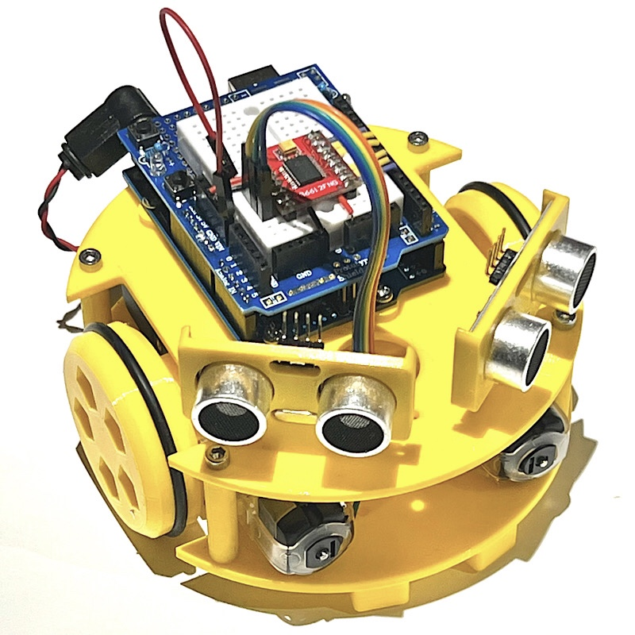

# Sapoconcho

Sapoconcho es un robot open-source educativo con que que introducirse en el mundo de la robótica y la programación. 
 

Está ideado con el objetivo de ser lo más accesible posible:
- Componentes comunes, fáciles de encontrar y económicos.
- Diseño sencillo para imprimir y montar.
- Modular y extensible.

En este repositorio encontrarás:
- `3d_models` Los modelos 3D necesarios para crear un kit.
- `arduino` Ejemplos de código de programación del robot.
- `docs` Fuentes de la documentación que genera el sitio [sapoconcho.bricolabs.cc](https://sapoconcho.bricolabs.cc)

Este proyecto antes estaba alojado en la wiki de bricolabs: 

- https://bricolabs.cc/wiki/proyectos/montaje_sapoconcho_xl
- https://bricolabs.cc/wiki/proyectos/sapoconcho
