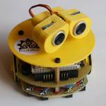
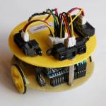
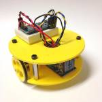
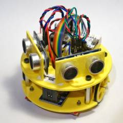
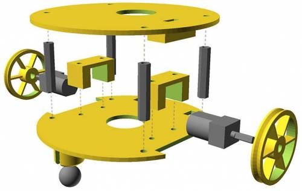
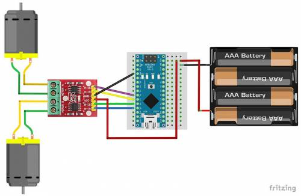
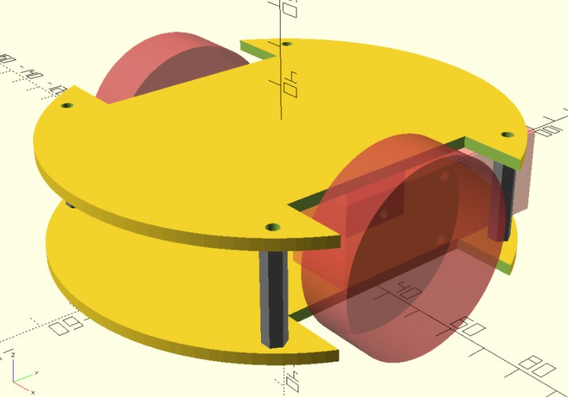
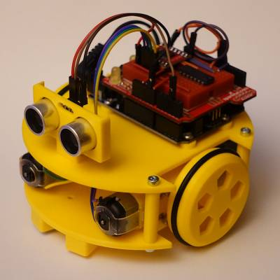
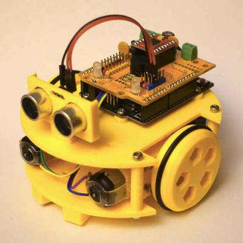
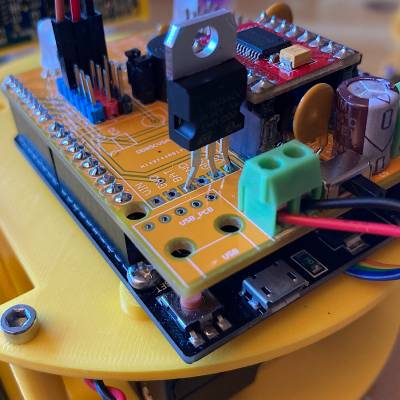

# Historia

!!! Note ""

    Yet Another Training Robot.

## El origen

Sabemos que lo que hacemos no es ninguna novedad. Este tipo de robots se puede encontrar en modelos comerciales y en muchos tutoriales a lo largo y ancho de la web. Sin embargo tenemos una experiencia de varios años en [Bricolabs](http://bricolabs.cc) que no queremos que se pierda. Llevamos tiempo cocinando la idea de crear un proyecto paralelo en forma a [Escornabot](https://escornabot.com/) para el siguiente segmento de edad, aunque por supuesto esto no es excluyente.

- A lo largo del año 2013 participamos en la iniciativa [KiiCS](https://kiicsmc2.wordpress.com/2013/10/10/nuevos-talleres-kiics/) de los Museos Científicos de A Coruña que se desarrolló en nuestra casa de acogida, la Domus. En estos talleres se utilizaron unos kits comerciales y que tienen algunas limitaciones además de su precio. Los destinatarios en aquella ocasión eran adolescentes y después se extendió a profesores de tecnología, que se han mantenido en otros posteriores. Además de diseñar y probar los cursos se crearon librerías de Arduino para el control de los motores con instrucciones sencillas. Una buena experiencia que nos sirvió para ver qué cosas funcionan bien en un curso y resultan entretenidas y divertidas.

- Casi al mismo tiempo fue surgiendo el proyecto [Escornabot](https://escornabot.com/) y el buen funcionamiento de éste nos anima a buscar un proyecto complementario dirigido a un segmento de edad mayor y a intentar otros objetivos: programar los robots con código fuente. Empezar editando los programas que ya existen, y poco a poco animarse a crear otras funciones y -por qué no- añadir otros módulos electrónicos.

- Además en los últimos años varios miembros de Bricolabs hemos hecho nuestros propios robots 'tortuga' con muchas funciones diferentes. También hemos seguido experimentando con diferentes plataformas de hardware y diferentes lenguajes de programación.

La idea es poner orden en toda la documentación que ya existe y que fue apareciendo por nuestra [wiki](http://bricolabs.cc/wiki). De ese modo se pretende poner en un único sitio toda la información necesaria para hacer dos cosas:

- Construir tu propio robot paso a paso, programarlo y usarlo como base para aprender o construir lo que quieras.

- Un curso completo autocontenido para que cualquiera puede ofrecerlo, modificarlo y extender la cadena del conocimiento hasta el infinito y más allá.

## Los primeros prototipos

| Prototipo        |                                                 |
| ---------------- | ----------------------------------------------- |
| Wall.E           |    |
| Teseo            |    |
| KIS              |              |
| KIS con sensores |           |

## Sapoconcho original de 90mm
Este fue el primer diseño con piezas impresas ( aunque hubo una fase anterior recortando protoboards). Fue un diseño que se ajustó a 90mm de diámetro pensando en que pudiese entrar en el concurso de laberinto de la [OSHWDEM](https://oshwdem.org/).

Sólo se necesitaban separadores de circuitos de 25mm (4 ud) y tornillos M2.5×20 para montar los motores al chasis inferior con sus soportes.

Los pasos para montarlo eran los siguientes:

1.  Monta la bola y los motores en la base inferior. La primera entra a presión, los motores con sus soportes atornillados (M2.5×20 tuerca) .
2.  Pega la controladora de motores y el portapilas a la base inferior con cinta adhesiva de doble cara.
3.  Monta la base superior con los separadores de circuitos.
4.  Pega la breadboard en la base superior para el Arduino micro. En su lugar puedes usar un Arduino UNO, que también cabe.
5. (opcional). Monta los soportes para los sensores SR-04 sobre la base superior.

Conecta la placa de motores al Arduino con el esquema siguiente.

## Sapoconcho 2021. The Expanse
Los modelos iniciales del proyecto utilizaban micromotores de tipo N20 en un chasis de 90mm de diámetro. Aunque sigue siendo un diseño válido, en 2021 hemos creado un nuevo chasis un poco más grande para poder expandir el ecosistema.

El nuevo chasis utiliza motores amarillos y tiene 120mm de diámetro, manteniendo el formato tortuga. Sabemos que 'motor amarillo' es un término muy genérico, pero si estás metido un poco en el mundo maker/DIY o haces una búsqueda rápida en tu plataforma favorita verás a qué nos referimos. Es un tipo de motor de corriente continua muy usado en todo tipo de proyectos y kits, muy fácil de conseguir y muy económico. Esos motores suelen traer una rueda pero no es necesario que la compres, utilizaremos una impresa de menor tamaño con una goma para que agarre. Además de los nuevos motores, el nuevo tamaño permite utilizar un pack de 4 pilas AA (y añadirle un módulo step-up si es necesario) o una batería recargable 18650.

Cuando tengan motores Epstein en Aliexpress habrá que reestudiar el proyecto.

Esto nos va a permitir aumentar la versatilidad del proyecto al poder meter más elementos en el chasis, y ampliar el número de plataformas hardware disponibles.

## Sapoconcho mClon
Cuando pensamos en ampliar el ecosistema inmediatamente se nos ocurrió que sería un desperdicio no aprovechar el trabajo estupendo del proyecto [mClon](https://tecnoloxia.org/mclon/) de [A Industriosa](https://aindustriosa.org/). Como el mClon utiliza dos motores amarillos, sensores de líneas y de ultrasonidos, la compatibilidad es total. En realidad lo único que hemos hecho es un chasis en el que se pueden montar los mismos elementos, tanto en la versión ShieldClon como en la versión ProtoShield. Os mostramos sólo las fotos del resultado. El proyecto está fantásticamente documentado en su web. Necesitarás usar una versión especial de la placa superior que tiene ya los soportes para un Arduino UNO (upper_plate_UNO_v1 ó v2). También una versión especial de la placa inferior que tiene unos soporte con parasol para los sensores de infrarrojos. Esa pieza es mejor que sea negra o cubrir esos parasoles con cinta o pintura negra.

Versión ProtoShield

Versión ShieldClon

Para poder utilizar el portapilas 4xAA (con step-up) es necesario hacer unos pequeños hacks a la placa de XDeSIG. Además de no montar el conector USB, hay que cambiar la resistencia de 2.2 ohm por una de 0 ohm (sí, has leído bien, cero, aunque puedes también hacer un puente con un cable), y en lugar del step-up para cargar la batería colocar un regulador LM7805.

## Versiones procrastinadas

- Sapoconcho Pico: el nuevo microcontrolador de Raspberry y una controladora de motores nos permitirá iniciarnos en el mundo de MicroPython.
- Sapoconcho micro:bit: la renovada plataforma de BBC nos permitirá elegir entre programar con bloques tipo Scratch o Python.
- Sapoconcho Zero: para quien quiera Python a toda potencia con una Raspi Zero y diferentes HATs.
- Sapoconcho RC: instala la placa que recomendamos en el proyecto [MeccanoRC](https://bricolabs.cc/wiki/proyectos/meccano_rc) y tu chasis ya se mueve!