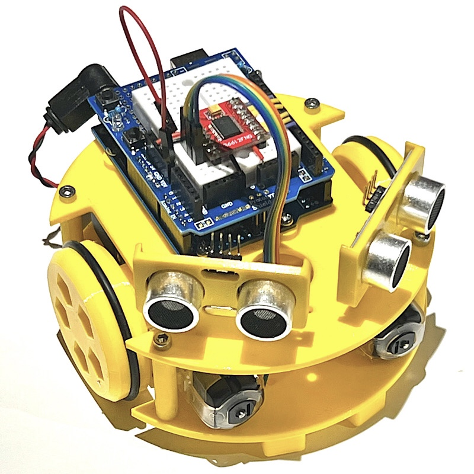

# Sapoconcho

Sapoconcho es un robot open-source educativo con que que introducirse en el mundo de la robótica y la programación. 
 

Está ideado con el objetivo de ser lo más accesible posible:
- Componentes comunes, fáciles de encontrar y económicos.
- Diseño sencillo para imprimir y montar.
- Modular y extensible.

En este sitio encontrarás:
- Listado de materiales y donde encontrarlos para crear un kit de Sapoconcho.
- Tutorial de montaje y programación de un Sapoconcho.
- Guia para preparar un taller de Sapoconcho.