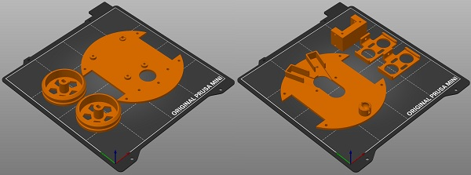

# Un Kit Sapoconcho

Un kit de Sapoconcho es un paquete con todas las piezas necesarias para montar un Sapoconcho. Para hacerte uno necesitarás una serie de materiales que detallaremos a continuación:

## Piezas imprimibles
El chasis de Sapoconcho XL consta de las siguientes piezas:

- Bases superior e inferior.
- Soporte de motores (1 unidad).
- Pilares de unión (o separación) de las dos bases (4 unidades). Pueden usarse en su lugar separadores de circuitos de 30mm.
- Ruedas (2 unidades).
- Soporte de sensores de ultrasonidos (1 ó 2 unidades).

En una impresora típica de 200x200mm se pueden imprimir todas las piezas en dos tandas.

Todas las piezas están en [este repositorio de Github](https://github.com/brico-labs/sapoconcho/tree/main/3d_models). Ahí puedes encontrar los archivos originales de OpenSCAD para modificarlos a tu gusto o los STL para imprimir directamente.

## Listado de materiales (BOM)

- Arduino UNO o compatible.
- Protoshield para Arduino UNO.
- Driver de motores TB6612 o DRV8833.
- Dos motores amarillos. Sabemos que es un término muy genérico, pero si estás metido un poco en el mundo maker/DIY o haces una búsqueda rápida en tu plataforma favorita verás a qué nos referimos. Es un tipo de motor de corriente continua muy usado en todo tipo de proyectos y kits, muy fácil de conseguir y muy económico. No necesitamos las ruedas que traen a veces.
- Gomas de fontanería para las ruedas (2ud). Medida 45×3 mm.
- Bola de acero de 10 mm.
- Sensores ultrasónicos HC-SR04 (1 ó 2 ud).
- Sensores de líneas por infrarrojos (2 ud).
- Portapilas para montar 4 pilas AA (dos encima y dos debajo).
- Elevador de tensión DC-DC (step-up, con los integrados LM2587/XL6009).
- Clavija de alimentación para Arduino UNO (5.5×2.1 mm).
- Tornillos M3 (12 ud M3x10, 4 ud M3x30, 4d M3x6).
- Tuercas M3 (4 ud).
- Cables Dupont M-H de 20mm y de 10mm.

Por si os es de utilidad, os dejamos una [lista de la compra en Amazon](https://www.amazon.es/hz/wishlist/ls/9FKST3X6WCM?viewType=list).

