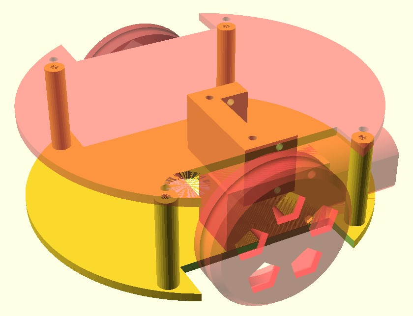
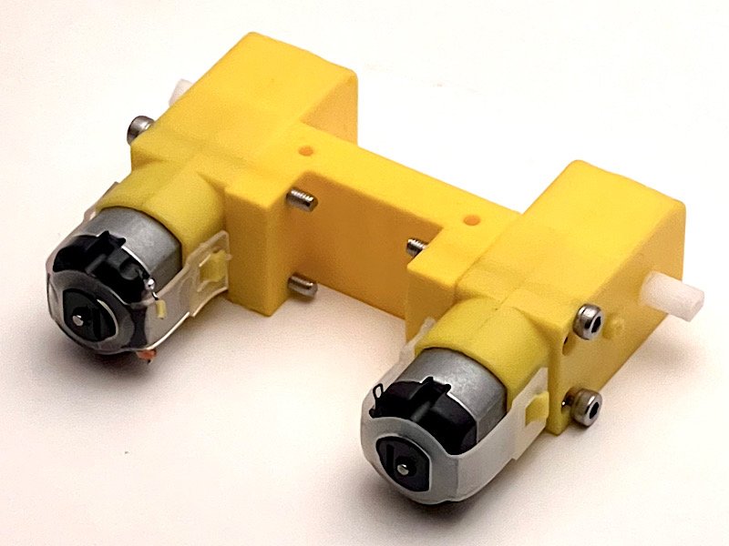
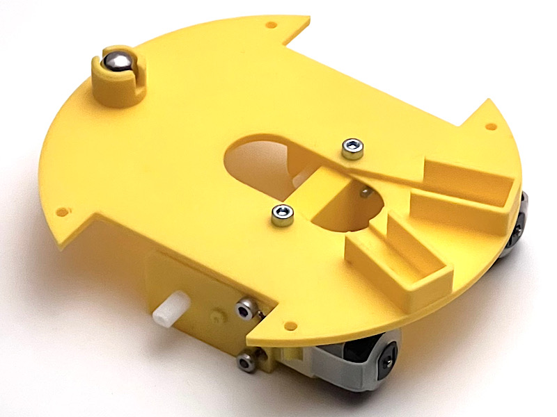
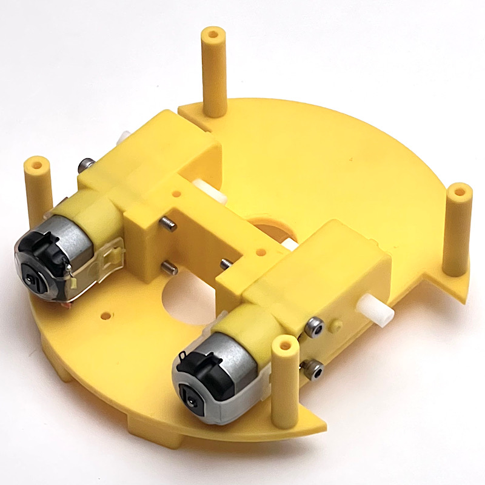
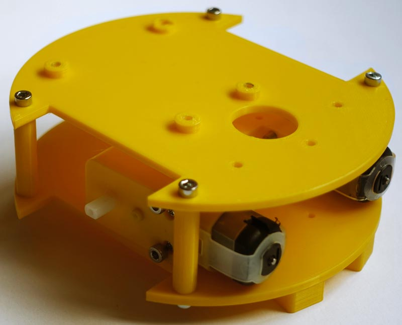
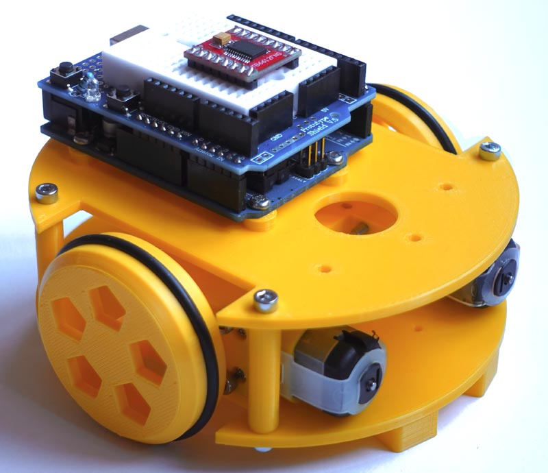

# Montaje Sapoconcho

Ahora que ya tienes tu kit, ¡vamos a montar el Sapoconcho!

## Montaje mecánico
El chasis base tiene pocas piezas y el montaje es muy sencillo.

**Paso 1**: Los motores amarillos se unirán al soporte con 4 tornillos M3x30.

**Paso 2**: Unir la base inferior al soporte con dos tornillos M3x12. También se puede poner ahora la bola loca o 'ballcaster', el tercer punto de apoyo.

**Paso 3**: Montar los 4 pilares a la base inferior con 4 tornillos M3x10.

**Paso 4**: Montar la base superior a los pilares con otros 4 tornillos M3x10. Ojo a la orientación en la foto.

**Paso 5**: Colocar las ruedas -cada una con su 'neumático'-, montar el Arduino UNO con tornillos M3 (dos en diagonal son suficientes) y pinchar la Shield sobre él.

## Montaje eléctrico/electrónico
Arduino no puede operar directamente un motor. Necesita un intermediario o driver. Existen dos drivers de motores muy parecidos y válidos para Sapoconcho XL: el Toshiba TB6612 y el DRV8833. Aunque los pines no son iguales, el cableado y la programación hacen que sean intercambiables.

Cableado del driver
La codificación de pines del driver TB6612 es la siguiente