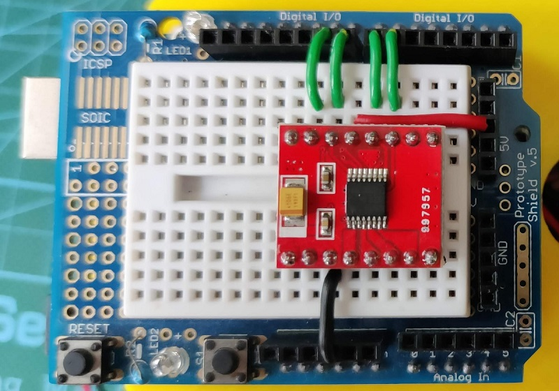

# Montaje Sapoconcho

Ahora que ya tienes tu kit, ¡vamos a montar el Sapoconcho!

## Montaje mecánico
El chasis base tiene pocas piezas y el montaje es muy sencillo.

**Paso 1**: Los motores amarillos se unirán al soporte con 4 tornillos M3x30.

**Paso 2**: Unir la base inferior al soporte con dos tornillos M3x12. También se puede poner ahora la bola loca o 'ballcaster', el tercer punto de apoyo.

**Paso 3**: Montar los 4 pilares a la base inferior con 4 tornillos M3x10.

**Paso 4**: Montar la base superior a los pilares con otros 4 tornillos M3x10. Ojo a la orientación en la foto.

**Paso 5**: Colocar las ruedas -cada una con su 'neumático'-, montar el Arduino UNO con tornillos M3 (dos en diagonal son suficientes) y pinchar la Shield sobre él.

## Montaje eléctrico
Arduino no puede operar directamente un motor. Necesita un intermediario o driver. En este caso utilizaremos el DRV8833.

!!! Note "Nota"

    Con una pequeña variación en el cableado, el driver Toshiba TB6612 también es compatible.

Para conectar el driver vamos a usar cable rígido de colores cortado a medida. Las conexiones son las de la imagen. Aunque el color de los cables no influye en el funcionamiento, para la alimentación y masa (tierra) se suelen utilizar los colores rojo y negro respectivamente.

A continuación hay que pinchar el driver teniendo cuidado con que los pines y los cable coincidan como en la foto.

**Cableado de los motores**  
Necesitamos cuatro cables Dupont de 20cmm soldados en un extremos a los motores y con punta macho en el otro extremo para la protoshield. Pueden ir agrupados para hacer un montaje más elegante, aunque no es imprescindible. Tampoco es imprescindible, pero si una buena idea añadir un condensador cerámico de 0.1uF (código 104) en paralelo en cada motor.

Los cables Dupont que vengan de los motores se conectarán ahora en los pines correspondientes.

Si al probar las funciones de movimiento alguna rueda gira al revés, puedes intercambiar los cables de ese motor.

**Alimentación**  
Para alimentación utilizaremos un portapilas para 4 pilas AA. Y para que valga para cualquier proyecto, puedas usar pilas recargables y reduzcamos la contaminación añadiremos siempre un regulador dc-dc elevador para elevar la tensión de salida (step-up). El LM2587 y el XL6009 valen y tienen un tornillo para regular la tensión de salida; un buen valor es 7,5v.

Las conexiones del step-up son muy sencillas: entrada positiva/negativa (IN+ rojo/IN- negro) desde el portapilas y salida positiva/negaviva (OUT+ rojo/OUT- negro) a la clavija. Además sacaremos un cable con un extremo Dupont macho (bstante largo) para alimentar el driver antes del step-up, de IN+ a VM.

