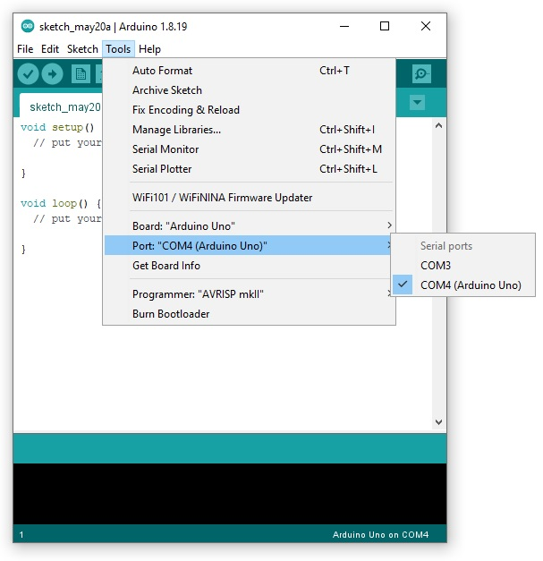
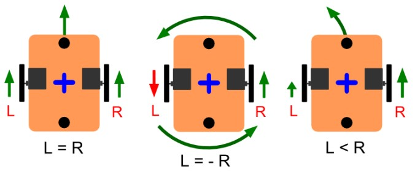
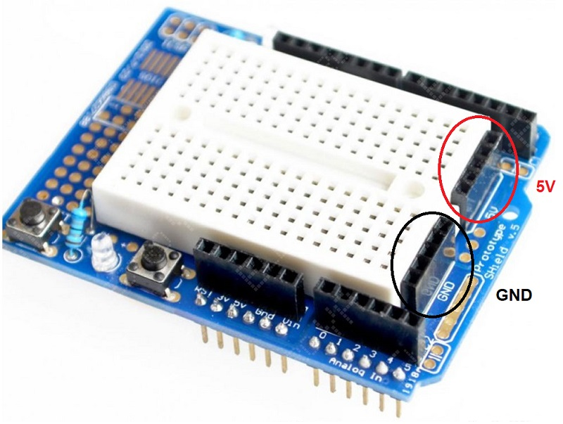
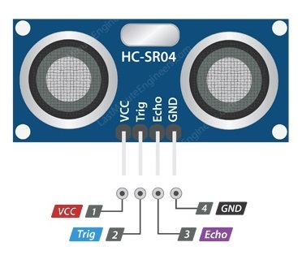
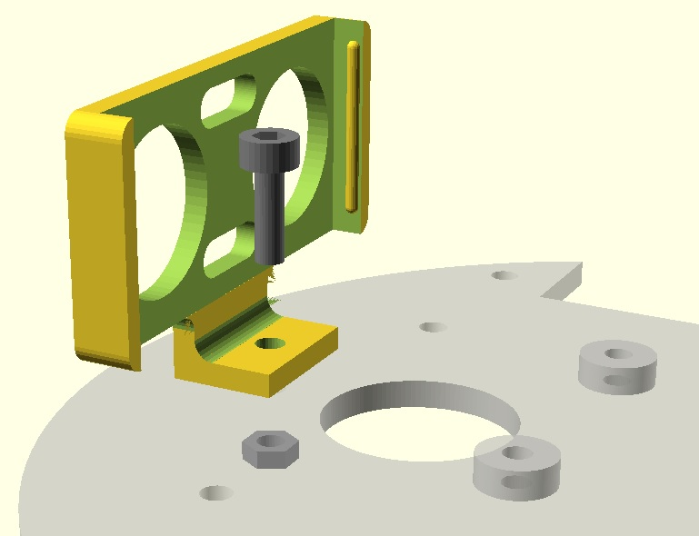
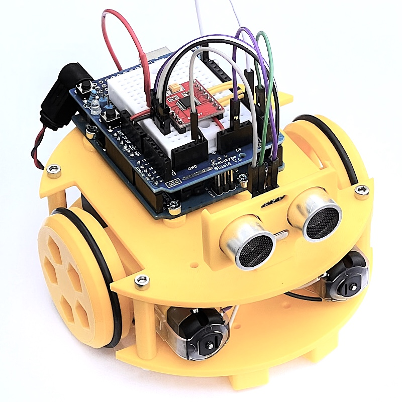
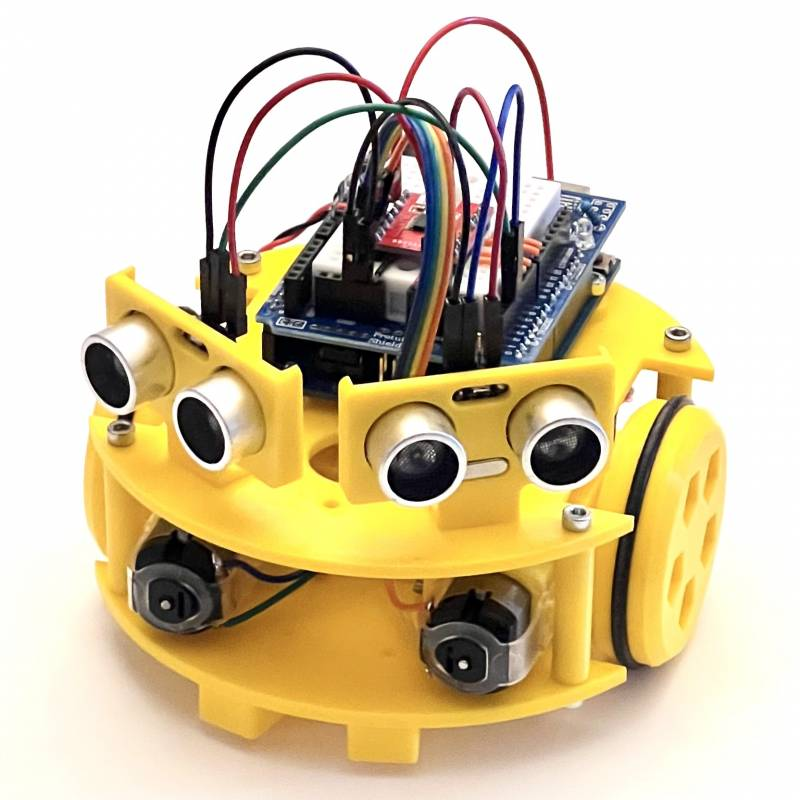
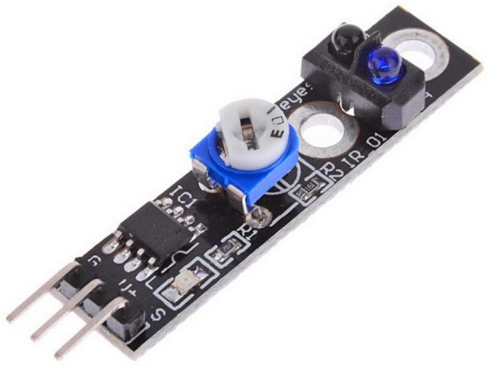
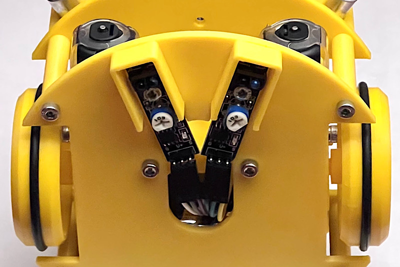

# Programación Sapoconcho

Ahora que ya tienes tu Sapoconcho montado.. ¡vamos a programarlo!

Lo primero que necesitas es [Arduino IDE](https://www.arduino.cc/en/software), el programa que te permitirá escribir el código en el robot. Una vez instalado conecta el Arduino al ordenador usando el cable USB de tu kit y abre Arduino IDE.



En el menú *tools* selecciona:

- Board: Arduino Uno
- Puerto: el puerto USB en el que tienes conectado el Arduino.

## Programando en Arduino
Programar en Arduino es muy sencillo, tenemos dos funciones en las que escribir nuestro código:

- Setup: el robot hará lo que escribas aquí cuando se encienda.
- Loop: el robot hará esto continuamente una vez finalice el setup.

```c
void setup() {

}


void loop(){

}
```

!!! Note ""

    Truco: Lo que escribas después de una doble barra "//" no se ejecutará, puedes usarlo para poner anotaciones en el código.

## Función de movimiento
Para decirle al robot que se mueva vamos a usar una función *drive* que os damos a continuación (copia y pégala al final de tu código):

```c
// función de movimiento de motores
// velocidad de las ruedas izquierda y derecha, positivo hacia delante, 
// tiempo en milisegundos
void drive(int L, int R, int t) 
{
//Arduino UNO y driver TB6612/DRV8833
  const int AIN2 = 9; // PWMA
  const int AIN1 = 8;
  const int BIN1 = 7;
  const int BIN2 = 6; // PWMB

//iniciar el modo de los pines para los motores
  pinMode(AIN1,OUTPUT);
  pinMode(AIN2,OUTPUT);
  pinMode(BIN1,OUTPUT);
  pinMode(BIN2,OUTPUT);

// evitar valores no válidos para el PWM
  L=constrain(L,-255,255);
  R=constrain(R,-255,255);

// poner valores a los pines
  digitalWrite(AIN1, L<0);
  analogWrite(AIN2, L+255*(L<0));
  digitalWrite(BIN1, R<0);
  analogWrite(BIN2, R+255*(R<0));

  delay(t);
}
```
Esta función nos permite decirle al robot la velocidad de la rueda derecha, rueda izquierda y un tiempo.

Ahora debemos llamar a esta función, para ello prueba a copiar y pegar la siguiente linea dentro del *loop* de tu programa:
```c
drive(200,200,1000);
```

Ahora para enviar el código al robot debes pulsar el botón *upload* .

Verás una barra de progreso y en unos pocos segundos tu robot habrá recibido su primer código!

Ahora desconecta el cable USB del Sapoconcho, conéctale las pilas y comprueba que avanza hacia delante.

**Movimientos de prueba**  
El uso de la función drive es sencillo. Se llama como drive (velocidad rueda izquierda, velocidad rueda derecha, tiempo) Las velocidades pueden estar entre -255 y 255. Positivo hacia delante, negativo hacia atrás. El tiempo en milisegundos.

Hay cuatro funciones básicas:

- Movimiento hacia adelante: drive(200,200,1000); probar a cambiar los valores de velocidad y tiempo.
- Movimiento hacia atrás: drive(-200,-200,1000);
- Giro en redondo: drive(-200,200,1000); probar hacia donde gira.
- Giro hacia el lado contrario: drive(200,-200,1000);
- Parar: drive(0,0,0);

La última es importante. Si no la incluimos después de cualquiera de las otras, el robot no parará.



El primer ejercicio puede ser ajustar los valores de movimiento hacia adelante para que se mueva en línea recta. Es poco probable que con dos valores iguales lo haga, los motores no son idénticos.

El segundo ejercicio puede ser ajustar los valores de movimiento de giro para que rote un ángulo fijado, por ejemplo 90 grados o 180 grados.

El tercer ejercicio puede ser encadenar órdenes para hacer figuras, por ejemplo un cuadrado, una estrella…

**Ejercicios más complejos:**  
La función drive con dos valores positivos pero diferentes describe un arco. Probar a encadenar arcos para hacer un movimiento en eses. Probar a poner obstáculos y salvarlos serpenteando.

## Montaje de los sensores

Los sensores tienen casi siempre dos pines de alimentación y uno o más pines de datos. La protoshield tiene en un lateral dos líneas para conectar la alimentación a positivo (5V) y negativo (GND).



### Sensores de ultrasonidos
Los sensores del ultrasonidos HC-SR04 tienen cuatro pienes: alimentación (VCC), masa (GND), trigger y echo. Estos dos últimos los unimos con una soldadura para ahorrarnos un cable, aunque tenemos que advertir que algunos modelos de algunos fabricantes no permiten esto, y al hacerlo no funcionan. Cablearemos con Dupont hembra-macho del sensor a la protoshield.



El montaje del soporte a la placa superior es sencillo, con un tornillo M3x10 y una tuerca. La placa tiene tres orificios, usaremos el central para montar un único sensor o los laterales para montar dos



Para leer la distancia que mide el sensor usaremos una nueva función, que de nuevo podemos guardar en una pestaña nueva en el IDE para dejar más limpio el programa principal.

```c
unsigned long sonar(int trig)
{
  pinMode(trig, OUTPUT);
  digitalWrite(trig,LOW); // trigger envia un pulso ultrasónico
  delayMicroseconds(5);
  digitalWrite(trig, HIGH);
  delayMicroseconds(10);
  pinMode(trig, INPUT);
  unsigned long tiempo=pulseIn(trig, HIGH);    // echo espera a recibir la respuesta
  unsigned long distancia= int(0.17*tiempo);  // fórmula para calcular la distancia
  return distancia;
}
```

El uso es sencillo, la llamamos como

```c
long int distancia = sonar(pin);
```

En donde le decimos a qué pin hemos conectado el sensor (en los siguientes programa utilizaremos el 2 y el 3), y la función nos devuelve la distancia al obstáculo en milímetros. [Este código](https://github.com/brico-labs/sapoconcho/blob/main/arduino/us_read.ino) permite leer el sensor y mostrar el resultado por el monitor serie de Arduino para comprobar que funciona.

Los montaremos con los soportes impresos con un tornillo y una tuerca.

**Mantener la distancia**  
Con un sensor de distancia montado de forma central probaremos la distancia a una pared. Si estamos aún lejos, avanzaremos. Si estamos muy cerca, retrocederemos para mantener la distancia. Si en vez de una pared ponemos la mano, probaremos a manejar 'a distancia' nuestro robot.



El código principal (al que añadiremos con las funciones drive y sonar) es el siguiente:

```c
void setup() {}

void loop() {
  long int distancia = sonar(2);
  if (distancia<100)
  {
    drive(150,150,50);
  }
  else
  {
    drive(-150,-150,50);
  }

}
```

Como diversión si estamos trabajando en grupo podemos poner todos los robots en fila y encenderlos a la vez a ver qué pasa.

**Evitar obstáculos**  
Con dos sensores de distancia podemos ver por donde está más cerca el obstáculo y girar hacia el lado contrario evitándolo.



El código ahora es:

```c
void setup() {}

void loop() {
  long int izquierda = sonar(2);
  long int derecha = sonar(3);
  long int distancia = min(izquierda, derecha);
  if (distancia<100)
  {
    if (izquierda<derecha) // cambiar menor por mayor si gira hacia el obstaculo
    {
      drive(150,-150,100);
    }
    else
    {
      drive(-150,150,100);
    }
  }
  else
  {
    drive(150,150,50);
  }

}
```

### Sensores de líneas

Los sensores infrarrojos de líneas, tanto con salida analógica como digital utilizan tres pines: alimentación (VCC), masa (GND) y señal. Debes revisar tu sensor, cada fabricante coloca los pines como quiere, y no tiene por qué coincidir con la foto.



Utilizaremos sensores basados en reflexión TCRT5000 con regulador (importante) que se montarán en el chasis inferior y se cablean a 5v, GND y dos entradas analógicas entre A0 y A5 (con cables Dupond H-M de 20cm).



**Seguir una línea**
Para leer los sensores no necesitamos una función extra, Arduino puede hacerlo con su propia analogRead(pin). El siguiente código lee los dos sensores y si uno de ellos está sobre la línea negra gira hacia el otro lado para evitarla (necesita la función drive).

```c
void setup() {}

void loop()
{
  if (analogRead(A0)<500) drive(-150,150,100);
  if (analogRead(A1)<500) drive(150,-150,100);
  drive(150,150,100);
}
```