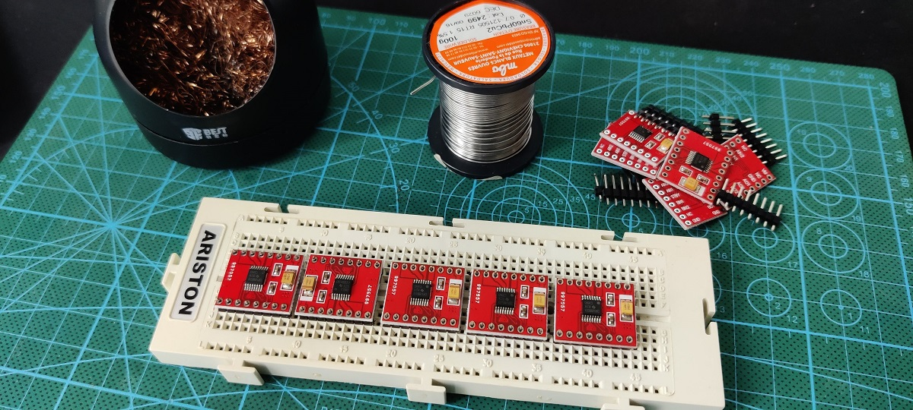
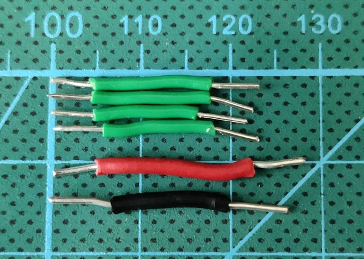
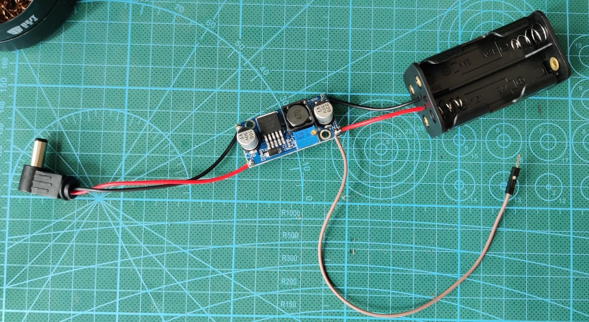

# Preparar un taller de Sapoconcho

Sapoconcho fue concebido principalmente para impartir talleres de robótica. El público principal para el que está pensado es para niños de entre 11 y 18 años o formadores que posteriormente utilizarán Sapoconcho en sus clases. Es muy habitual y recomendable que si los niños son pequeños (11-14 años) hagan el taller acompañados por un adulto.

## Duración del taller
Basándonos en experiencias anteriores podemos indicar las siguientes duraciones:

- Montaje: 60 minutos
- Programación movimiento: 45 minutos
- Programación ultrasonidos: 45 minutos
- Programación siguelineas: 45 minutos

Es posible alargar el taller o dividirlo en dos sesiones si se incluye la parte de preparado de los kits. Para esta parte la edad recomendada debería ser un poco mayor ya que requiere soldar con estañador.

## Preparativos previos

### Preparando los kits

Las siguientes indicaciones pueden ahorrarnos problemas durante el taller:

- Preparar al menos un 1 kit extra por cada 10 por si faltan o fallan piezas en alguno.
- Revisar los diámetros de los agujeros en las piezas impresas, especialmente los del eje de los motores que deben entrar justos.
- Soldar los pines del driver de motores.

- Cortar y pelar los cables para breadboard a medida.

- Soldar cables al step-up y al conector de alimentación.

- Regular el voltaje del step-up.
- Soldar los dos pines centrales del sensor de ultrasonidos.

### Preparativos de los participantes
Es recomendable que los participantes traigan Arduino IDE instalado en sus portátiles de forma que evitemos problemas con la descarga o instalación durante el taller.

## Durante el taller

Es recomendable tener a mano los siguientes materiales y herramientas por si fuesen necesarias:  
- Estación de soldadura (estañador, estaño y demás útiles)
- Destornillador eléctrico con punta hexagonal
- Cable para breadboard
- Alicates de corte
- Pelacables
- Multímetro
- Lima y broca de 3mm (por si los diámetros del eje de las ruedas fuesen pequeños)
- Loctite (por si los diámetros del eje de las ruedas son demasiado holgados)
- Cinta de doble cara
- Bridas
- Instalador de Arduino IDE en un pen-drive